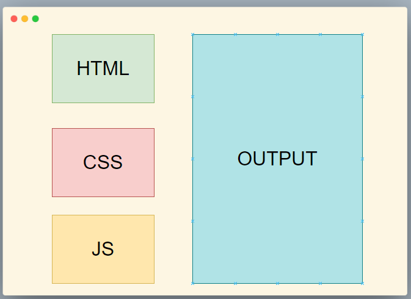

# [Day01] - 參賽的起因 & 研究的動機

大家好 , 我是第三年參加的 Tree , 很開心可以參加 IThome 鐵人賽 , 

也很感謝 `六角的同學` 願意接受我的推坑 , 組隊一起參加今年的挑戰

身為推坑者 , 期望今年能完成 30 天的挑戰 ( 畢竟去年失敗了 `(*>﹏<*)′` )

也祝福各位參賽者能夠完成今年的挑戰 O(∩_∩)O

---

各位邦友 , 肯定有許多疑惑 , 為何要 Parser 研究這個主題呢 ?

下面請聽我娓娓道來 , 今年同事推薦了我一本書 , 這本書的名字叫做

[《Vue.js 設計與實現》](https://www.tenlong.com.tw/products/9787115583864)

我看了這本書之後 , 對於

- 第　15章 編譯器核心技術概覽　
- 第　16章 解析器　

深深的著迷 , 而且有種被震撼的感覺 , 原來 Vue 程式運作是基於這樣的機制做字串解析 , 

然後生成到 DOM 中阿 ,  

以前我有聽過 Vue 是 Virtual DOM , 但我其實完全不清楚是如何運作的 ,

看了這本書之後 , 對於 Vue 的運作原理有了更深的了解 , 因此想要更深入的研究 Parser 的運作

對於這 30 天的目標是 , 實作出一個能在瀏覽器運行的簡單 Vue Parser

- 示意圖

期望我能順利 ^_^
