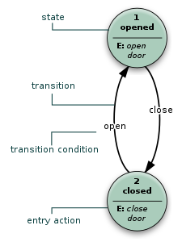
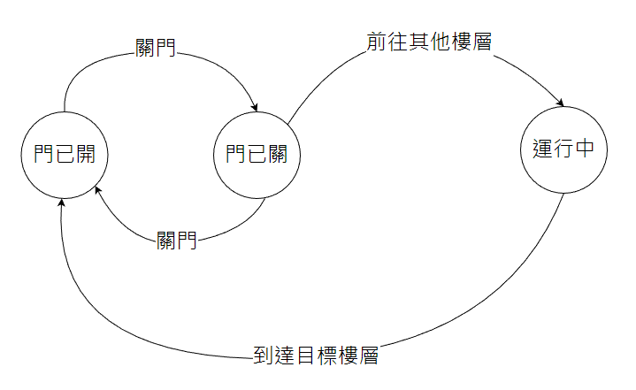

# [Day06] - 逐字分析的行前準備(一) - 狀態機介紹

## 狀態機

狀態機是一種抽象的機器，它有一個或多個狀態，由不同條件控制狀態的轉換，並且在不同狀態下有不同的行為。

上圖示電梯簡化的狀態圖，它有兩個狀態：門已關、門已開，由關門、開門兩個動作做狀態的切換。

一般我們會用 `狀態轉移表` 來分析狀態的變化 ( 表中代表動作切換後的狀態，`x` 代表不變 )。

| 當前狀態→ 條件↓ | 門已開 | 門已關 | 
| --- | --- | --- | 
| 關門 | 門已關 | x |
| 開門 | x | 門已開 | 

當然電梯的狀態肯定不只這些 , 他還有 `運行中` 這個狀態 , 下面我們分析一下 , 加上 `運行中` 這個狀態有的改變

1. 在`運行中`狀態下，關門動作不會造成任何狀態變化
2. 在`運行中`狀態下，開門動作不會造成任何狀態變化
3. 在`門已開`狀態下，切換樓層，會記錄目標樓層，不過不會造成任何狀態變化
4. 在`門已關`狀態下，切換樓層，直接切換成 `運行中` 狀態，前往目標樓層
5. 到達目標樓層後，自動執行 `開門` 將狀態切換成 `門已開` 
6. 在`門已開`狀態下，確認是否有紀錄目標樓層，如果有，則切換成 `運行中` 狀態，前往目標樓層

> 狀態圖

> 狀態轉移表

| 當前狀態→ 條件↓ | 門已開 | 門已關 | 運行中 |
| --- | --- | --- |  --- | 
| 關門 | 門已關 | x | x |
| 開門 | x | 門已開 | x |
| 前往其他樓層 | x | 運行中 | x |
| 到達目標樓層 | x | x | 門已開 |

當然現實中的電梯，有 `關門中` 跟 `開門中` 這兩個狀態，來防止進出電梯門的乘客被夾扁

[被電梯夾圖.gif]

> 小作業：請思考一下，如果要加入 `關門中` 跟 `開門中` 這兩個狀態，該如何表達 `狀態轉移表` 跟 `狀態圖` 呢？

---

邦友可能會困惑，上述電梯的例子我們看得懂，但是為什麼要用狀態機要如何套用在 `Tokenizer` 的逐字解析中呢？

明天我們來說明一下，為什麼要用狀態機來解析 `.env` 檔案，以及如何應用狀態機來解析 GO GO ~~。

### 參考資料

- [Day 21：什麼是「有限狀態機」？](https://ithelp.ithome.com.tw/articles/10225343)
- [Day08 - 實作一個狀態機 - 1](https://ithelp.ithome.com.tw/articles/10270230)
- [台部落 - 用python模擬電梯程序](https://www.twblogs.net/a/5bafa38b2b7177781a0f391a)
- [WIKI - 有限狀態機](https://zh.wikipedia.org/wiki/%E6%9C%89%E9%99%90%E7%8A%B6%E6%80%81%E6%9C%BA)
