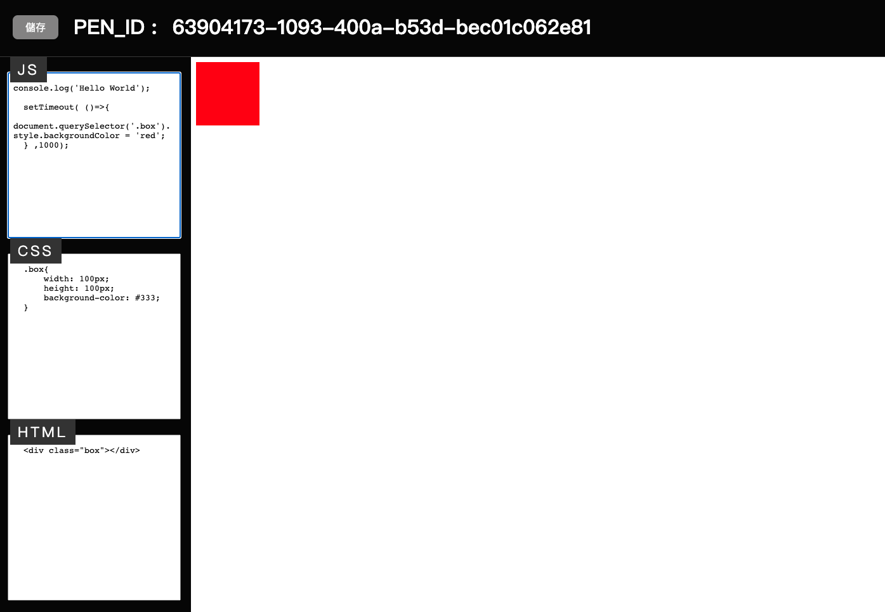
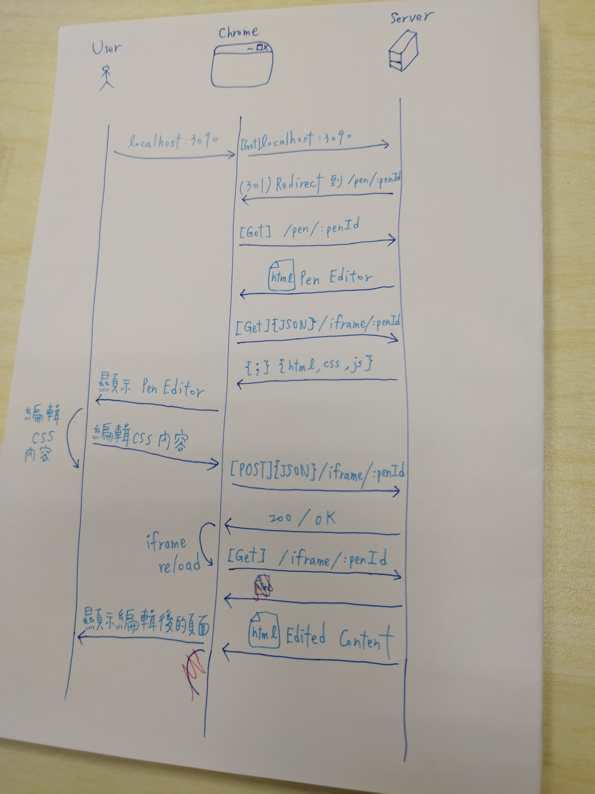

# [Day31] - Mimic CodePen 介面

day-1 時我們目標自製一個 vue 在 client-side 去 render JS . HTML . CSS 三大部分

經過 30 天的說明，我們解決了 CSS 跟 HTML 在 client-side render 的部分

JS on client-side render 的部分，有點超出我目前的能力（可能需要多花時間了解）

下面我們就用 iframe 來復刻 Codepen 的功能吧！

## 需要用到的工具

- express.js
- node.js

## 架構說明

- 畫面：分成 CSS . JS . HTML 編輯區(textarea) & 畫面顯示區(iframe)



- HTTP：
  - GET ${server}/pen/:penId = 顯示三個編輯區的 HTML
  - POST ${server}/iframe/:penId = 將編輯的 HTML . CSS . JS 傳給 server
  - GET ${server}/iframe/:penId = 用於 iframe 的顯示，會利用 POST 傳入的 HTML . CSS . JS 組出對應的 HTML

### 時序



1. 訪問 localhost:3090
2. 被 redirect 到 localhost:3090/pen/:penId 的頁面
3. 載入預設的 html，並在載入時執行 init 的相關 JS
4. 利用 localhost:3090/data/:penId，來取得已設定的 html . css . js 到對應的編輯區
5. 編輯 html 時，post 目前編輯區的 html . css . js 給 server
6. 得到剛剛的 post 回覆 200/OK 後，將 iframe 做 reload

### 實作

#### 1.Pen 編輯頁面

```html
<!DOCTYPE html>
<html lang="zh-TW">
<head>
  <meta charset="UTF-8">
  <meta name="viewport" content="width=device-width, initial-scale=1">
  <title>Client CodePen</title>
  
  <!-- 引用 github 上設定好的 style -->
  <link rel="stylesheet" href="https://raw.githubusercontent.com/andrew781026/ithome_ironman_2022/main/day-31/src/style/style.css">
</head>
<body>
<header>
  <button class="save-btn">儲存</button>
  PEN_ID :
  <span id="penId"></span>
</header>
<main>
  <div class="container">
    <div class="wrap" data-title="js"><textarea id="js" cols="30" rows="10"></textarea></div>
    <div class="wrap" data-title="css"><textarea id="css" cols="30" rows="10"></textarea></div>
    <div class="wrap" data-title="html"><textarea id="html" cols="30" rows="10"></textarea></div>
  </div>
  <iframe src="" id="iframe"></iframe>
</main>

<script>
  const debounce = (job, delay = 1000) => {
    let timer = null;
    return function () {
      timer && clearTimeout(timer);
      timer = setTimeout(job, delay);
    }
  }

  const getPenId = () => location.pathname.split('/').pop();
  const updatePenId = () => {
    const penId = getPenId();
    document.querySelector('#iframe').src = `http://localhost:3090/iframe/${penId}`;
    document.querySelector('#penId').innerText = penId;
  };

  const iframeReload = () => document.querySelector('#iframe').contentWindow.location.reload();

  async function updateIframe() {

    const data = ['js', 'css', 'html']
      .map(item => [item, document.querySelector('#' + item).value]);
    const json = Object.fromEntries(data);

    await fetch(`http://localhost:3090/iframe/${getPenId()}`, {
      body: JSON.stringify(json), // must match 'Content-Type' header
      cache: 'no-cache', // *default, no-cache, reload, force-cache, only-if-cached
      credentials: 'same-origin', // include, same-origin, *omit
      method: 'POST', // *GET, POST, PUT, DELETE, etc.
      headers: {
        'Content-Type': 'application/json'
      },
    });

    iframeReload();
    document.querySelector('.save-btn').classList.remove('need-update');
  }

  async function initIframe() {

    // 取得已存在的 PenId 資訊 - HTML . CSS . JS
    const response = await fetch(`http://localhost:3090/data/${getPenId()}`, {
      cache: 'no-cache', // *default, no-cache, reload, force-cache, only-if-cached
      method: 'GET', // *GET, POST, PUT, DELETE, etc.
      headers: {
        'Content-Type': 'application/json'
      },
    });

    const data = await response.json();

    // init the html , css ,js data
    ['js', 'css', 'html'].forEach(item => document.querySelector('#' + item).value = data[item]);
  }

  // 綁定 JS . CSS . HTML 三個編輯區塊的 keyup event
  const bindKeyupEvent = () => {

    const debounceUpdateIframe = debounce(updateIframe);

    ['js', 'css', 'html'].forEach(item => {
      document
        .querySelector('#' + item)
        .addEventListener('keyup', () => {
          document.querySelector('.save-btn').classList.add('need-update');
          debounceUpdateIframe();
        })
    })
  }

  const init = () => {
    updatePenId();
    bindKeyupEvent();
    initIframe();
  }

  init();
</script>
</body>
</html>
```

#### 2.Express 


#### 3.iframe 頁面


