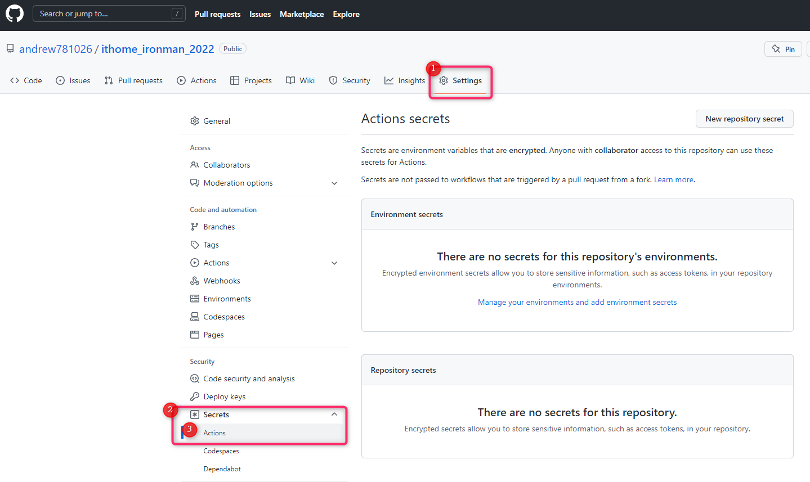

# IT 鐵人賽，自動發文工具

## 介紹

- 這個工具是用來幫助 IT 鐵人賽的作者，自動發文到 IT 鐵人賽的網站上。

使用方式如下 :

1. 將文章放在任意資料夾中，並 git commit 到 github repo 中
2. 在 github 上設定 secret `USER_NAME` 跟 `PASSWORD` ，分別是 IThome 的帳號密碼

> secret 設定的位置在 `repo > Settings > Secrets > Actions` 中


3. 設定 `puppeteer` 資料夾中的 `articles.json`，格式如下

```json
[
  {
    "folder": "day-01",
    "title": "[Day01] - 參賽的起因 & 研究的動機",
    "contentPath": "article.md"
  },
  {
    "folder": "day-02",
    "title": "[Day02] - Parser 是什麼，可以吃嗎？",
    "contentPath": "article.md"
  },
  {
    "folder": "day-03",
    "title": "[Day02] - Parser 是什麼，可以吃嗎？",
    "contentPath": "article.md"
  }
]
```

4. 剛剛設定的 `articles.json` 中的第幾個代表第幾天的文章
5. 設定好後，就可以在 github-action 就會在每天 10 點幫你發文了 ~~
